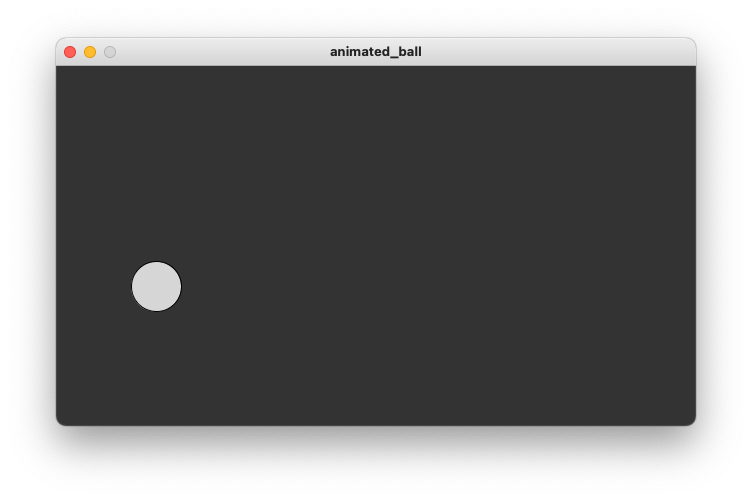

# Animated Ball

In this example we want to introduce movement. Animation works through drawing slightly different images in quick succession. Our draw method is called many
times per second. Every time we slightly move the ball to a new coordinate. This gives the illusion of movement.

We therefore need a variable that changes with each iteration of drawing. Luckily processing
already provides us with such a variable. It is called `frameCount`. So in this example
we change the `y` coordinate of our ball based on the `frameCount` variable.

# Preview

