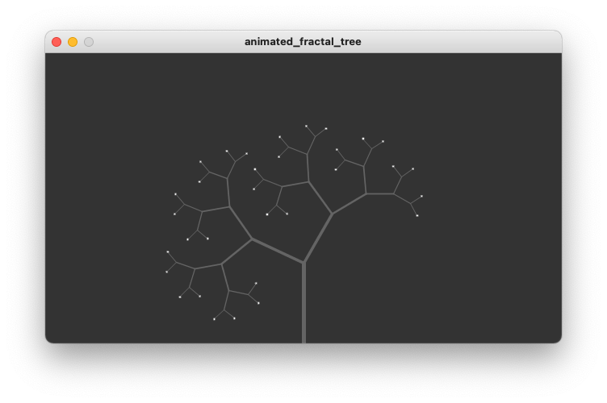

# Animated Fractal Tree
In this example we explore the concept of animation in the context of the previous fractal tree example. We want to animate the angles in the tree so it
looks like the tree is moving with the wind.

# Preview
