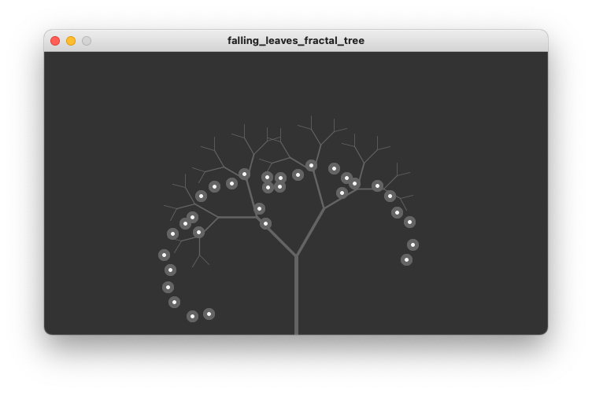

# Falling Leaves Animated Fractal Tree
In this example we want to make the leaves of the tree fall to the ground.
This would be pretty easy if the leaves where positioned using screen coordinates.
Since we used recursive transformation though this is not quite as easy.
We first need to find the screen coordinates of our transformed origin and then
reset that to that screen coordinate system so we can animate in that system.

# Preview
