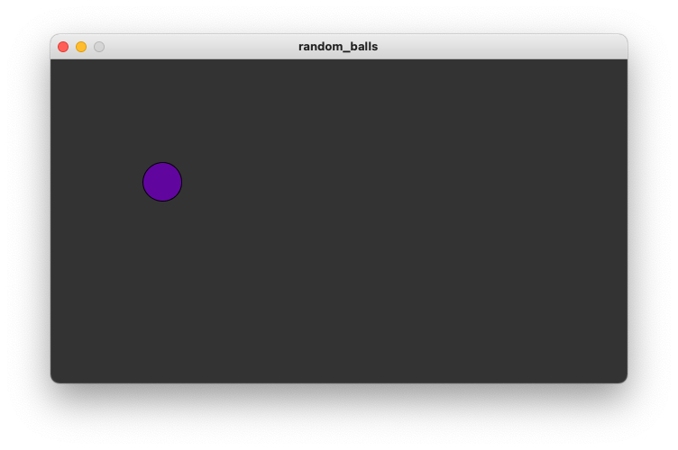

# Random Balls

Sometimes you want to move objects randomly. But how can you tell the computer that you want to move by a "random" amount.
Luckily processing has a function called `random`. It allows you to get a random number in a specified range. So every
time you call `random(40)` it will return a different random number between 0 and 40. Let's use this
concept to move a ball randomly.

# Preview

